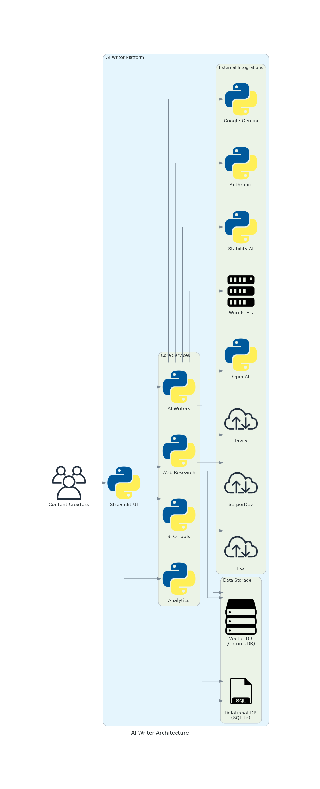
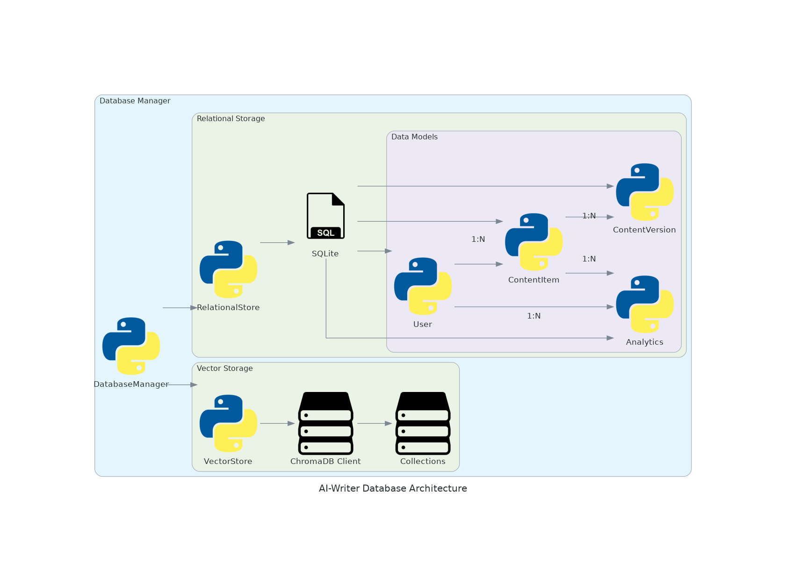
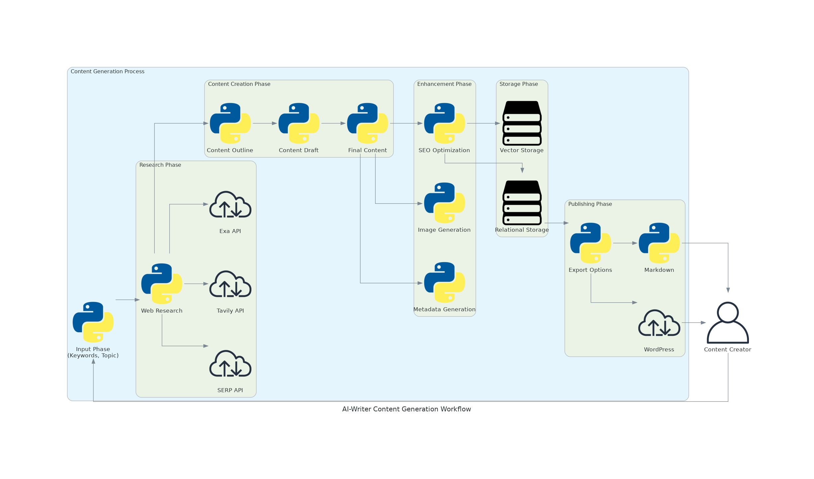

Architecture Overview
====================

This document provides a comprehensive overview of the AI-Writer architecture, explaining the system's components, their interactions, and the design principles behind the implementation.

High-Level Architecture
----------------------

The AI-Writer platform consists of several key components:

1. **User Interface Layer**
   
   * Streamlit-based web interface
   * Command-line interface for automation
   * API endpoints for programmatic access

2. **Core Services Layer**
   
   * AI Writers: Various specialized content generation modules
   * Web Research: Tools for gathering factual information from the internet
   * SEO Tools: Utilities for optimizing content for search engines
   * Analytics: Content performance tracking and analysis

3. **Data Storage Layer**
   
   * Vector Database (ChromaDB): Stores embeddings for semantic search
   * Relational Database (SQLite): Stores structured data like user preferences and content metadata

4. **External Integrations Layer**
   
   * LLM Providers: OpenAI, Google Gemini, Anthropic, etc.
   * Search Providers: Tavily, SerperDev, Exa, etc.
   * Image Generation: Stability AI
   * Publishing Platforms: WordPress, Jekyll, etc.

Database Architecture
--------------------

The database architecture consists of two main components:

1. **Vector Storage**
   
   * Uses ChromaDB for storing and retrieving text embeddings
   * Enables semantic search capabilities
   * Stores content in collections for efficient retrieval

2. **Relational Storage**
   
   * Uses SQLite for structured data storage
   * Key models include:
     - User: Stores user preferences and settings
     - ContentItem: Represents content created by users
     - ContentVersion: Tracks version history of content
     - Analytics: Stores performance metrics for content

Content Generation Workflow
--------------------------

The content generation process follows these steps:

1. **Input Phase**
   
   * User provides keywords, topics, or other input parameters
   * System configures the generation process based on user preferences

2. **Research Phase**
   
   * Web research is conducted using various search providers
   * Relevant information is gathered and processed
   * Facts are extracted and organized for use in content generation

3. **Content Creation Phase**
   
   * Content outline is generated based on research
   * Initial draft is created using AI models
   * Final content is refined and polished

4. **Enhancement Phase**
   
   * SEO optimization is applied to improve search visibility
   * Images are generated or selected to complement the content
   * Metadata is generated for better categorization and discovery

5. **Storage Phase**
   
   * Content is stored in both vector and relational databases
   * Embeddings are created for semantic search capabilities
   * Metadata is indexed for efficient retrieval

6. **Publishing Phase**
   
   * Content is formatted for the target platform
   * Publishing options include WordPress, Markdown, and others
   * Content is delivered to the user or published directly

Design Principles
----------------

The AI-Writer architecture is built on the following design principles:

1. **Modularity**
   
   * Components are designed to be independent and interchangeable
   * New AI models and services can be added with minimal changes
   * Functionality is organized into logical modules

2. **Extensibility**
   
   * The system is designed to be easily extended with new features
   * Plugin architecture allows for custom integrations
   * Configuration options enable customization without code changes

3. **Reliability**
   
   * Error handling is implemented throughout the system
   * Fallback mechanisms ensure continued operation
   * Logging provides visibility into system behavior

4. **Performance**
   
   * Caching is used to improve response times
   * Asynchronous processing for long-running tasks
   * Efficient data storage and retrieval mechanisms

5. **Security**
   
   * API keys are securely stored and managed
   * User data is protected with appropriate measures
   * Input validation prevents common security issues

Future Architecture Enhancements
-------------------------------

Planned improvements to the architecture include:

1. **Distributed Processing**
   
   * Support for distributed content generation
   * Load balancing for improved scalability
   * Parallel processing of research and generation tasks

2. **Advanced Caching**
   
   * Intelligent caching of common queries and results
   * Cache invalidation strategies for fresh content
   * Distributed cache for multi-user environments

3. **Enhanced Security**
   
   * Role-based access control
   * End-to-end encryption for sensitive data
   * Advanced authentication mechanisms

4. **Containerization**
   
   * Docker containers for easier deployment
   * Kubernetes support for orchestration
   * Microservices architecture for better scalability